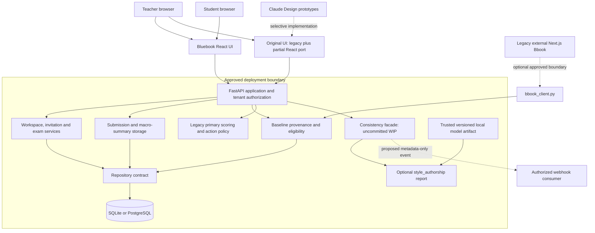
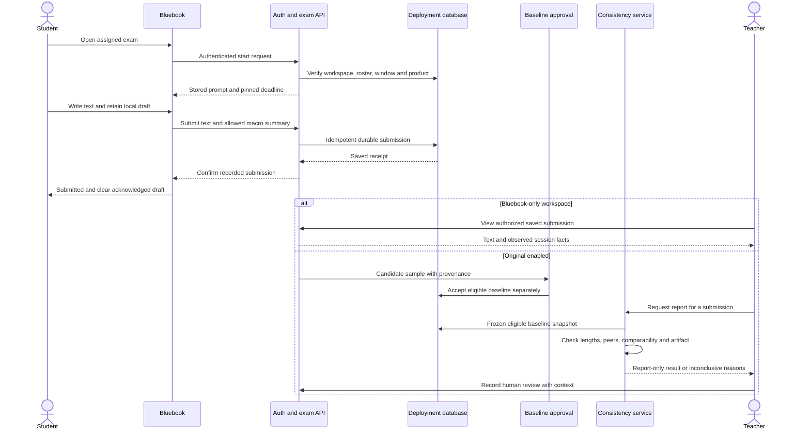
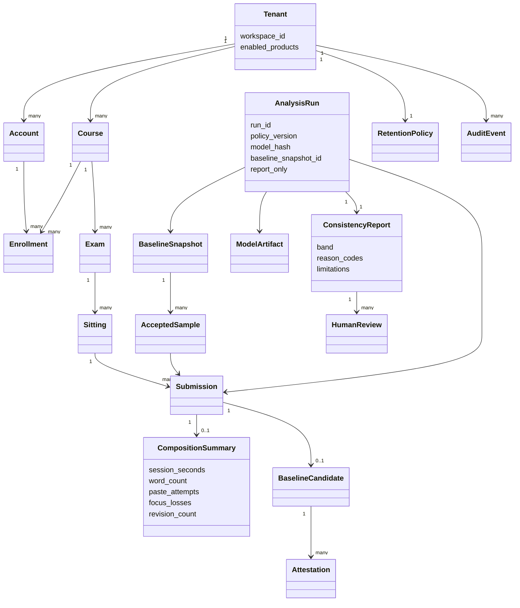

# Original + Bluebook: canonical project reconstruction

**Evidence snapshot: 29 September 2026 · Version 1.0 · Private working knowledge base**

This reconstruction prioritizes Claude Code, Claude Design and GitHub, following the latest instruction. Canvas/LTI implementation is deferred and is not a dependency of the roadmap. It retains research, business and privacy context where it changes a product or implementation decision.

**Authority rule:** current user constraints govern product intent; exact source code and Git state govern implementation claims; measured reports govern empirical claims; conversations explain decisions; prototypes establish design intent; plans and marketing establish hypotheses. Newer text does not automatically outweigh working code. “Implemented” does not mean deployed, validated on students, legally cleared, or commercially adopted.

References such as [S01] resolve in the source index at the end. The accompanying inventory records local paths, snapshots and discovery coverage without reproducing private conversation bodies or student prose.

## A. Executive project brief

Original is a local-deployment writing-consistency and research system. It measures text, compares a submission with a student's prior writing, and can present evidence for a careful human conversation. Its justified near-term claim is **“show how this writing compares with an adequately established baseline, including when comparison is inconclusive.”** Neither the code nor the inspected evaluation supports a general claim to determine cheating, identify AI authorship reliably across settings, or establish a calibrated probability that a student wrote a paper. [S01,S09,S10,S19–S23]

Bluebook is the writing and exam product that can operate independently, and can also supply supervised writing to Original. A critical correction to the inherited project description is necessary: **there are two Bluebook implementations.** The older `bbook`/`bbook_1` copies use Next.js and a Python `bbook_client.py` adapter. Newer Claude Code work implements a standalone Bluebook product inside the existing FastAPI application with a React interface. It has teacher signup, workspaces, courses, student invitations, exam windows, submissions and exports. Bluebook-only workspaces deliberately do not create Original profiles or run Original scoring. Thus “Bluebook is a Next.js app” is historical, not a complete description of the newest product. [S02–S04,S12,S13]

The largest immediate problem is source fragmentation. GitHub main is behind significant local Claude work; multiple worktrees contain alternate implementations and uncommitted changes. An attractive design and a passing selected test suite can each coexist with missing product behavior. A single integration baseline, a truthful interface and a documented release boundary are more urgent than another detector or another architectural rewrite.

**Recommended canonical integration candidate:** the clean local `claude/bluebook-student-erasure` branch at `150316c1`, stacked directly on the newer Bluebook branch at `0cf7d342`. This is a recommendation, not a merge or release approval. Preserve and compare the separate design port, pilot workflow and consistency API before bringing their useful pieces across. GitHub main remains the authoritative record of what is published there. No repository changes, merges, pushes or deployments were made in this reconstruction. [S01–S07]

Keep the incremental Python/FastAPI, scikit-learn, joblib, Pydantic and httpx foundation. Preserve report-only results, feature flags off by default, text and coarse session information only, and student text within the deployment. Evaluate the independent Bluebook product separately from the much harder scientific claim behind Original. Ship neither accusatory conclusions nor unsupported privacy/security badges.

### What can be said today

| Claim | Reconciled position |
|---|---|
| There is substantial implemented software | Yes: application, persistence, scoring, exam workflow and multiple interfaces exist. |
| The newest work is all on GitHub | No. Important clean commits and dirty worktrees are local. |
| Bluebook needs Original to work | No on the newest branch; products are isolated. |
| Original is scientifically validated for student misconduct decisions | No evidence establishes that. Several meaningful validation gates fail or are uninformative. |
| Newer tests prove readiness | Historical Claude reports support engineering progress, with explicit exclusions and gaps; they do not establish deployment or model validity. |
| Claude Design is implemented end to end | No. There are exported prototypes, a partial React port and newer cloud concepts with invented demonstration data. |
| There are confirmed paying customers | None established by inspected evidence. Targets, price points and outreach plans are hypotheses. |

## B. Current architecture and module map

### B1. Reconcile the actual versions first

| Snapshot | Exact state inspected | Meaning and disposition |
|---|---|---|
| GitHub `pathosbuilder895/Orig`, main | `b29ae2a3dfa748e0c42d3d553faf1b0bdf52cf77`, 9 Sep; public; 710 commits in cloned history | Published baseline. Do not describe newer local features as already merged. [S01] |
| Desktop `Original` | `1e7c1cad9db5d1b68307667a7ea79d72e18abcf8`, `cursor/canvas-document-processor`; 42 modified/untracked status entries at inventory | Contains separate pilot work and readiness material. Preserve the dirty tree; do not use its branch name as the project's identity. [S05] |
| Claude adversarial/SP1 | `ac507041f2300431ff16250c47b258a7c7e9eadd`, clean | Macro-only policy, threat model and earlier adversarial work. Included through later history in the new Bluebook line. [S08] |
| Claude standalone Bluebook | `0cf7d342284e127cd6e5bd4b26b2a021750c2deb`, clean | New standalone product and dashboards. Local, not evidence of live deployment. [S02,S03] |
| Claude student erasure | `150316c1abe2f35221ba6d2e79c982ebe398d2c5`, clean; three commits atop `0cf7d342` | Most useful integration candidate; still has deletion/session follow-ups. [S04] |
| Claude design import | `2ad8cedcb729063dd9ec231d94a78b14ea195f10`, 73 dirty entries | Valuable React interface port; preserve patch separately. Local preview claims are not production routing. [S06,S15] |
| Claude authorship verification | same `2ad8ced…` base, 13 dirty entries | Alternative package includes process/keystroke logic and unauthenticated opt-in routes. Reuse selectively, not wholesale. [S07] |
| Codex consistency work | `ac507041…` base, `codex/adversarial-consistency-sp1`, 19 dirty entries | Report-only consistency endpoint and gate work exist uncommitted; completion is not established. [S11] |
| `Desktop/bbook`, `Desktop/bbook_1` | Local Next.js copies; no `.git` found in inspected roots | Treat as separate legacy implementation snapshots. No connected Bbook GitHub repository located. [S12,S13] |

Counts describe the inventory moment, not permanent properties. “Status entries” are not necessarily individual files. Full paths and hashes are in `source-inventory.json`.

### B2. Runtime modules

| Area | Current code location / behavior | Boundary to preserve |
|---|---|---|
| Application assembly | `run.py` → `original/api.py` → domain routers | One deployed configuration must determine routes, flags and product availability. |
| Identity and workspace access | Auth/principal logic; new `original/routers/bluebook_accounts.py`; per-workspace student access | Authorization on the server, not merely hidden interface buttons. |
| Bluebook | `original/routers/bluebook.py`, account routes, `demo/bluebook/` React | Exam recording works independently of Original scoring. |
| Persistence | `original/repository.py`, SQLite `store.py`, PostgreSQL `postgres_repository.py`, live DB models | Backend contract parity; migrations, backups and erasure tested on both. |
| Primary legacy analysis | feature extraction and `original/quantum/` scoring, conformal/null/pooling/longitudinal helpers | Classical numerical representation; score is not a proven authorship probability. |
| Style authorship channel | `original/style_authorship.py`, versioned joblib artifact | Report-only, optional, fail closed; preserve artifact/schema checks. |
| Consistency facade | Uncommitted `original/consistency.py` and `original/routers/consistency.py` in Codex tree | A separate report without altering the primary decision or baseline. |
| Baseline acquisition | baseline routes, request/provenance logic; optional `original/bbook_client.py` | A submission is a candidate until provenance and eligibility are accepted. |
| Institutional pilot | Uncommitted `original/pilot/` in Desktop tree | Invitation-based research workflow, controlled snapshots, jobs and evaluation; distinct from public self-service. |
| Original UI | Legacy `demo/*.html`; partial newer `demo/app/` React; design exports | Explicitly choose routes to ship; `/app` was blocked in real deployment on main. |
| Research | `validation/`, `docs/research/`, model and calibration reports | Offline evidence must not silently become production policy. |

An old “two backends and three frontends” description is stale: the former `original/main.py` and `original/api/` v1 layout was deleted during July consolidation. Some `original/core` and DB modules remain genuine dependencies. Do not delete them based on the old-stack label. [S01,S09]

### B3. Bluebook's two integration paths

**Newest embedded path:** teacher creates a workspace and course, invites students, publishes an exam, and sees saved submissions. The application stores products; Bluebook-only workspaces skip Original score and baseline calls. The newest dashboard fixes a serious older behavior: a failed recording must not show “Sealed” and remove the local draft. Stored exam content and deadline are authoritative. Warning counts and times are observable session facts, not proof of misconduct. [S02,S03]

**Legacy external path:** Python `bbook_client.py` uses optional `BBOOK_API_URL` and `BBOOK_EXTERNAL_SECRET`, provisions a baseline request through `/api/external/baseline-request`, and obtains status/callback results. The Next.js side includes Prisma, PostgreSQL and NextAuth; an external request identity supports correlation. The August wire proof did not establish an available live external deployment. The external path is optional, not a prerequisite for the embedded application. Old raw-key mappings in `originalKeystrokeMap.ts` conflict with today's data-minimization rule. [S12–S14]

**Recommended relationship:** Bluebook owns writing sessions and immutable submissions; Original consumes explicitly approved samples and emits optional reports. A Bluebook-only account need not have an Original profile. This distinction must survive storage, erasure, exports, navigation and billing decisions.

### B4. Feature and eligibility truth

Main's feature schema has 109 total positions: 102 base plus 7 comparison features. The inspected September accounting distinguishes 89 measurable, 7 scoring-only, 1 structurally blank and 12 disabled positions. Older “62”, “103” and “all markers measured” descriptions refer to different versions or presentations. None is a quality metric. Keep stable schema indices while retiring raw behavioral dimensions; do not imply every position contributes evidence. [S09,S10]

Main's authentication weights include proctored 2.0, verified 1.0, Canvas 0.8 and unverified 0.5. Consequently `auth_weight > 0` does **not** mean “verified.” Some documentation states different values or exclusion of unverified samples. A single trusted-baseline policy remains necessary. The whole application does not uniformly enforce the style channel's minimum. [S09,S10]

The style channel requires enough retained long samples, a sufficiently long probe and a peer population; the inspected v1/consistency path uses three distinct baseline samples of at least 300 words, a 300-word probe and at least ten eligible peer profiles. Failures should produce an inconclusive reason, not a negative authorship judgment. The uncommitted consistency schema names consistent/inconclusive/divergent, but its current v1 logic only emits consistent or inconclusive. Do not promise divergent classification merely because it exists in a type. [S10,S11]

### B5. Claude Design → Claude Code → release mapping

**Updated user decision:** `original-bluebook-teacher.html` in the live Claude Design project is the primary visual reference for Original and especially the teacher side of Bluebook. Other interfaces are implementation resources, not competing visual defaults. See the [teacher-dashboard integration brief](Teacher-Dashboard-Integration-Brief.md) for the verified screen-to-backend mapping and changes required to older prototype assumptions. This choice supersedes the previously open selection of a primary teacher interface.

There are three distinct design states: the exported HTML prototype in the attic; the August React port in a dirty Claude worktree; and the live Claude Design project with 38 pages and newer My Voice work. They are not interchangeable snapshots. The live dashboard still shows fixture counts such as 128 students and 7 flags; those are a prototype presentation, not evidence of actual customer usage. The latest visible design conversation explicitly describes the literary-match percentages and timeline history as invented. [S06,S15–S18]

| Experience | Design intent / inspected evidence | Implementation reconciliation | Recommended next treatment |
|---|---|---|---|
| Overview | Scholarly photographic frame, gold indicators, summary and review queue | August port uses health/students/manifests data; cloud design remains a fixture-driven reference | Keep visual hierarchy; replace accusatory labels and do not imply a score is a probability |
| Students | List leading to an individual writing profile | Port drops mockup columns unsupported by API | Contract every displayed field; preserve truthful missing-data states |
| Submissions | Review queue and new-work submission | August port keeps full submission form and makes queue the landing view | Keep collection separate from admission to baseline |
| Reports | Verdict/header, statistics and weekly visualization | Port uses actual manifest statistics and honest empty state | Reframe verdict language; distinguish review workload from accuracy |
| Settings | Sensitivity, connections and course cards | Port replaces fabricated “Connected” badges with real configuration status | Deferred integrations stay out of launch navigation; no unsupported compliance claims |
| Student detail | Profile, measured features and threshold gauge | Port corrects fabricated kappa label to actual baseline purity | Explain actual quantity and eligibility; don't call purity identity confidence |
| Quantum / feature inspector | Interactive state-vector markers and textual comparison | Live design says all 103 bars open a marker window; API support for every excerpt is not established | Map schema version and actual marker data; visual clickability does not prove evidence availability |
| Conversation packet | Printable material for a humane discussion, including side-by-side passages in mockup | `Packet.jsx` exists locally; live/stashed and historical modes differ; historical aligned prose unavailable in inspected API | Keep provenance and limitations; no fabricated attributed quotations |
| Fingerprint / decomposition / interference | Interpretability and distinctive visual identity | Screens/components exist; educational meaning and quantitative claims need separate review | Optional explanatory detail; accessible reduced-motion alternatives |
| Bluebook teacher/student shells | Course/exam management and writing workflow | New Sept 28 branch contains actual self-service teacher and student flows, substantially newer than older design port | Prefer real current workflow; apply design styling selectively |
| My Voice growth timeline | Portrait changes across a student's writing history | Live cloud prototype has invented dates/values; not established in local production code | Backlog hypothesis requiring real longitudinal data and measurement semantics |
| Writer lineage / Library | Chesterton/Lewis/Tolkien comparison and reading discovery | Cloud example says 81%, 74%, 38%; explicitly demo numbers | Do not import these values; treat comparison as optional learning feature, not identity or quality score |
| Voice-card sharing / export / privacy view | Student agency and visibility of stored records | Latest chat proposes ideas; no verified implementation in inspected source | Privacy/export is useful; sharing requires voluntary, minimized disclosure |
| Streak / class-wide unlock | Engagement and baseline completion | Proposal, not implemented evidence | Avoid coercive class incentives and treating participation as proof of trust |

The coherent design direction is already present: restrained scholarly typography, clear course/work context, inspectable measurements and a printable discussion aid. The corrections are principally about **truth of content, student agency and deployment readiness**, not abandoning the aesthetic. A compact implementation contract should accompany each screen: role, route, source fields, units, denominator, sample eligibility, timestamp, loading/error/empty/inconclusive states, and whether fixture data is visibly labeled. [S16,S17]

## C. Chronological reconstruction

| Period | Evidence-backed evolution | What it supersedes or leaves unresolved |
|---|---|---|
| March 2026 | Master roadmap describes a 62-feature system, early infrastructure and a 12–16 week paid-pilot ambition. | A planning document, not proof those milestones happened. [S25] |
| May 12 onward | Inspected Git history begins with adaptive scoring and deployment configuration; real dashboard wiring, explanation, cold-start and calibration work follow. | Earlier development may predate this repository; Git history does not reconstruct every conversation. [S01] |
| June–July | Baselines, scoring, interfaces and operations expand; old frontend/backend paths later consolidate. Business notes describe seminary-first positioning and premium institutional pricing. | “Pilot ready” and revenue forecasts were ahead of demonstrated evidence. [S24,S26] |
| July 22 onward | Bluebook exam robustness/corrections work and backend consolidation; interface and validation branches proliferate. | Browser restrictions remain deterrents and observables, not OS-level control. [S01,S02] |
| Late July–early August | Adversarial and authorship experiments test LUAR, AI-origin/cause channels, pooling and baselines. | Benchmark success is conditional; external detector portability disappoints. [S19–S23] |
| August 13–17 | Claude imports Claude Design, ports dashboard/reports/settings/student/submissions and printable packet; alternative authorship package built in another tree. | Large uncommitted trees persist. Packet cannot supply real aligned passage evidence from existing historical APIs. [S06,S07,S15] |
| September 7–9 | New calibration/term simulations expose failed and uninformative gates; `/app` deployment is restricted; GitHub main reaches current inspected head. | Neither rising test counts nor new visuals resolve statistical validity. [S01,S19,S20] |
| September 16 | Internal readiness report and institutional-pilot work focus on controlled, non-consequential student research. | Not evidence that a pilot was launched or approved. [S05,S27] |
| September 20–21 | Macro-only ADR, adversarial threat model/SP1 and Codex consistency work; removal of raw keystroke direction becomes explicit. | Earlier keystroke plans and PR #160 should not guide current product work. [S08,S11,S32] |
| September 28, Eastern time | New standalone Bluebook teacher/student product becomes a clean local branch; erasure follow-up adds three more commits. | No push/deployment proved. Bulk erasure and token invalidation remain incomplete. Claude logs use UTC, so some entries read September 29. [S02–S04] |
| September 29 inspection | Live Claude Design shows 38 pages and newer My Voice concepts; current request prioritizes code/design/GitHub and defers Canvas/LTI. | Cloud design is newer than the exported bundle; a full version-to-version design diff is still needed. [S16] |

## D. Dependency-ordered implementation roadmap

This is the recommended roadmap, not a claim that work below has been performed. Roles are responsibilities to assign, not confirmed team members. Dates should follow measured effort after integration; arbitrary launch dates would conceal the current uncertainty.

| Step | Work and owner | Dependency | Concrete exit evidence |
|---|---|---|---|
| 0. Preserve and name | Engineering: snapshot dirty design, pilot, verification and consistency trees; record exact bases; choose `150316c1` as candidate or document another choice. | None | Recoverable patches/commits and a branch manifest; no unique work overwritten. |
| 1. Establish one runnable baseline | Engineering: compare candidate against GitHub; keep standalone Bluebook and macro-only changes; identify independent PR/test changes. Create a reviewable integration branch. | 0 | Fresh install/build, migration and selected CI results tied to one commit; all exclusions visible. |
| 2. Close account/deletion integrity gaps | Engineering/security: workspace-wide erasure enumerates Bluebook-only identities; revoke or revalidate signed student sessions after erasure; guard mixed Original/Bluebook deletion; retain minimal audit receipts. | 1 | Deleted user cannot recreate records with an old token; repeat erasure and both persistence backends tested. |
| 3. Verify the no-raw-telemetry boundary | Engineering/privacy: trace browser→schema→logs→storage→export; allowlist macro fields; reject/strip nested legacy key data; inspect legacy adapter; document backup purge treatment. | 1 | Wire/storage/log fixtures contain no per-key/dwell/flight/character trace; purge dry run reviewed, actual deployment migration separately evidenced. |
| 4. Choose a truthful interface | Design+engineering: map each desired Claude Design screen to real API fields, loading/empty/error states and access role; port only supported components. | 1; 2–3 before release | A screen/data contract, no invented student metrics, no unavailable passage evidence, keyboard/reduced-motion/contrast checks; routes reachable in intended environment. |
| 5. Finish Bluebook as an independent product | Product/engineering/operations: validate invitations, password lifecycle, exam windows, reconnect/retry, save receipts, multi-question content, teacher export, free-workspace limits and recovery support. | 2–4 | End-to-end teacher→student→submission→teacher journey on deployment-like storage and configuration; duplicate submission and failed-save tests; support runbook. |
| 6. Unify baseline trust policy | Research+engineering: separate raw submissions, eligible candidates and accepted baselines; bind tenant/student/session; protect replay and duplicate samples; freeze policy/version per run. | 3,5 | Every intake path uses the same policy; unverified weight cannot masquerade as attestation; no automatic contamination from ordinary submissions. |
| 7. Finish the report-only facade | Engineering: reconcile Codex consistency WIP with latest branch and selected pilot code; authenticated tenant-scoped endpoints, reason codes, no-store response, safe logs, immutable report-only property. | 6 | Flag off gives no feature exposure; enabled reports do not mutate primary recommendation/baseline; unsupported comparisons abstain. |
| 8. Validate the scientific claim | Research: finish adversarial gate work, preregister thresholds and honest-writing outcomes; evaluate real consented student writing by author/course/time, genre, accommodations and language background; lock held-out data. | 6–7 | Separate false-alert/false-accept metrics and confidence intervals; drift/baseline-growth and honest-term budget pass; no retrospective threshold tuning on lock set. |
| 9. Run a controlled institutional pilot | Institution+privacy+operations: approved purpose, data agreement, retention, consent/notice as applicable, access/review/appeal, backups/restore, incident and support process. Invitation-based research, no academic consequences. | 2–8 for Original; Bluebook-only has a separate readiness decision | Signed/approved operating boundaries, verified deployment, research protocol, named human review owners and stop conditions. |
| 10. Promote only supported capabilities | Product/research: decide whether evidence warrants report-only Original launch, broader Bluebook use or continued research; then refine pricing/onboarding. | 9 | Written go/no-go tied to outcome, burden and privacy evidence. No misconduct automation. |
| 11. Explore coaching | Product/research/design: real longitudinal views and optional literary comparisons, with independent measurement validation and student controls. | Stable baseline provenance and consent; separate coaching evaluation | No invented similarity percentages, conformity incentives or pooled student leaderboards; coaching benefit assessed separately from detection. |

**Deferred by request:** Canvas/LTI implementation, integration certification and LMS marketplace work. These do not block the standalone path. Existing integration endpoints still need ordinary deployment exposure review; deferring feature development does not make an exposed unsafe route acceptable.

**Critical path:** one source baseline → account/privacy correctness → honest Bluebook experience → trusted baselines → report-only comparison → empirical pilot evidence. Design polish and offline research can progress alongside it, but cannot substitute for these gates.

## E. Decision and contradiction register

| ID | Decision | Evidence and rationale | Status |
|---|---|---|---|
| D01 | Keep Python/FastAPI and the incremental model stack. | Existing modules and constraints favor consolidation over rewrite. | Governing direction |
| D02 | Keep independent Bluebook product entitlement. | Newer Claude code deliberately avoids Original profiles/scoring for Bluebook-only tenants. | Implemented locally; integrate |
| D03 | Use newest embedded Bluebook as primary candidate; retain Next.js adapter only for a defined external deployment. | Two products with similar names otherwise create duplicate identity and data paths. | Recommendation |
| D04 | Keep text and macro timing; drop raw keystroke biometrics everywhere. | User constraint and accepted ADR-010 supersede old work, including open PR #160. Disabled scoring never guaranteed disabled collection. | Governing; deployment verification open |
| D05 | Keep report-only consistency separate from legacy primary actions. | New channel does not neutralize existing escalate/schedule-conversation logic. | Integration requirement |
| D06 | Replace a single “authenticity/AI probability” presentation with measured comparison and reasoned uncertainty. | Numerical score semantics and student validity are not established. | Product requirement |
| D07 | Change baseline acceptance into one explicit policy. | `auth_weight > 0` admits unverified samples; minimums differ across paths. | Unbuilt consolidation |
| D08 | Keep the Design visual language and usable navigation; drop invented evidence and unsupported badges. | Source design and port logs distinguish mock data from real API fields. | Selective port |
| D09 | Keep the conversation packet's purpose; omit historical aligned quotations until supported by genuine stored data and alignment. | August port explicitly found no endpoint for past submission prose/alignment. | Current limitation |
| D10 | Keep My Voice timeline as a hypothesis; do not ship current literary percentages as measurements. | Live Design says dates/match values are fabricated demo numbers. | Planned only |
| D11 | Drop class-completion unlock pressure, compulsory sharing and writer ranking. | Engagement ideas conflict with voluntary, individual and non-accusatory pedagogy. | Recommendation |
| D12 | Keep adversarial experiments offline; drop blanket “90% detector” ambitions without a defined task/population. | Research results vary sharply by domain and transformation. | Research boundary |
| D13 | Do not integrate raw behavioral fusion, open-set author naming or cause detectors as production integrity judgments. | Policy/IP concerns plus poor transport and error evidence. | Excluded pending new evidence and review |
| D14 | Treat claimed trade secrets and patent freedom as unresolved, not settled. | Orig is public; earlier notes assume proprietary secrecy; FTO references partly unresolved. | Counsel decision needed |
| D15 | Defer Canvas/LTI implementation. | Latest explicit user instruction. | Current scope |
| D16 | Replace “pilot ready” and “all tests pass” shorthand with commit, command, exclusions and deployment status. | Latest historical suite excludes blocker/certification tests; operational prerequisites remain. | Documentation standard |

Specific stale assumptions: 62/103 feature counts; two independent backend architectures; “unverified excluded”; uniform three-sample gating; all Bluebook is Next.js; every design page is deployed; every UI marker has real textual evidence; report-only means no other path escalates; green tests mean calibrated accuracy; downloaded patent means complete freedom-to-operate search. None should be carried forward without qualification.

## F. Product, customer and use-case map

| Person / organization | Need | Appropriate product behavior | Proof still required |
|---|---|---|---|
| Seminary or writing-intensive college instructor | Collect supervised writing; discuss unexpected differences without unfair accusation | Bluebook sessions; baseline provenance; comprehensible report with abstention and context | Usability, time saved, acceptable honest-writing alert burden |
| Academic dean / program leader | Consistent pedagogy and review process | Institution policy, human review, aggregate operational reporting without student ranking | Procurement willingness, governance, outcomes and total operating cost |
| Student | Reliable writing submission, fair treatment and insight into their own work | Clear save status, access to own submissions, explanation/correction process, optional coaching | Accessibility, trust and benefit; no pressure to imitate a baseline |
| IT / privacy / institutional counsel | Control of records and service risk | Deployment-bound text, tenant isolation, access logs, retention/deletion, contracts, incident response | Audited configuration and institutional acceptance; no generic compliance badge |
| Research partner | Evaluate writing consistency in realistic conditions | Consented longitudinal corpus, split-by-author evaluation, frozen analysis and protected exports | Ethical protocol, genuine author provenance, representativeness |
| Independent teacher using Bluebook | Set and review exams without adopting Original | Free/private workspace, invitations, stored prompts and saved text/export | Recovery/support and deployment readiness; demand and retention |

Initial customer hypotheses favor seminaries and small writing-intensive institutions. Named prospects in planning include SBTS, Fuller, DTS, RTS, Covenant, SEBTS, Biola/Talbot and Asbury; these are **prospects, not verified customers**. July notes proposed roughly $2,400 pilots, $7,500 seminaries and $18,000 colleges, plus high margins and substantial ARR projections. Treat these as scenario inputs until tested against procurement, hosting/support costs, privacy review and teacher value. The latest outreach note reports 0/14 contacted and no responses, while older strategy names 25 targets; that is an operating tracker versus an aspirational list, not a contradiction proving either count is current. This reconstruction did not independently inspect the underlying email. [S24,S26,S28]

A coherent product sequence is: dependable writing collection → institution-controlled baseline provenance → cautious writing comparison → optional coaching if evidence supports it. Bluebook can deliver the first value before Original's full inference claim is validated. Do not bundle every research idea into the initial buyer promise.

## G. Risk register and research reconciliation

### G1. Material risks

| ID / severity | Risk and observed trigger | Required response / evidence | Owner role |
|---|---|---|---|
| R01 Critical | A genuine writer is treated as suspicious. Term simulations and small live API diagnostics show over-alerting in legacy actions. | Report-only boundary; disable consequential automation; define honest-term alert budget and validate on real student writing. | Research/product |
| R02 High | Product releases the wrong tree or loses unique changes. At least four significant WIP lines coexist with main and newer clean local commits. | Snapshot dirty trees, exact integration manifest and reproducible release commit. | Engineering |
| R03 High | Deleted Bluebook students retain usable tokens or bulk deletion skips them. Explicit latest Claude findings. | Token revocation/revalidation and profile-independent workspace enumeration; regression tests. | Security |
| R04 High | Raw key events survive in old clients, API payloads, database rows or backups despite disabled flags. | End-to-end field allowlist and versioned migration; demonstrate purge execution per deployment. | Engineering/privacy |
| R05 High | Unverified or adversarial writing poisons a baseline; duplicates inflate evidence. | Explicit provenance, deduplication, approval and frozen baseline snapshots; no auto-accept of every submission. | Research/engineering |
| R06 High | Cross-tenant access or accidental disclosure through exports/logs/notifications. | Negative authorization tests on every new route, safe error handling, minimized logs and content-free webhook defaults. | Security |
| R07 High | Prototype numbers or invented excerpts become student-facing evidence. | Field-by-field data contracts and honest empty/inconclusive states. | Design/product |
| R08 High | Domain transfer fails: literary texts, pseudoauthors and benchmark transformations differ from student work. | Independent student lock set; subgroup, genre, longitudinal and accommodation analysis; explicit abstention. | Research |
| R09 High | Broad “no text leaves deployment” promise is broken by hosted inference, external adapter, analytics, logs or agent usage. | Define deployment boundary including backups; inspect actual network/configuration; prohibit external student-text inference and unrelated content telemetry. | Privacy/operations |
| R10 High | Patent or model-license constraints invalidate an approach. Two patents located; older citation handles unresolved; one detector checkpoint noncommercial. | Claim-level counsel review, family/jurisdiction/status checks, exact model/data license register. | Counsel/engineering |
| R11 High | A public repository undermines trade-secret assumptions. | Inventory what is public and when; separate protectable know-how and contract strategy. Do not claim secrecy or patent loss as a settled conclusion. | Founder/counsel |
| R12 High | Green selected CI masks excluded security checks or operational gaps. Latest suite omits `blocker` and `certification`. | Publish exclusions and exposure analysis; verify restore, secrets, migration, alerts and deployment behavior. | Engineering/operations |
| R13 Medium–High | Signed joblib artifact becomes supply-chain execution path. | Load only trusted pinned artifacts, validate signatures/schema and restrict write access; fail closed. | Security |
| R14 Medium–High | Coaching becomes conformity pressure or disguised discipline. | Separate purpose, permissions and evaluation; no leaderboard or automatic adverse decision; student explanation and challenge. | Product/institution |
| R15 Medium–High | Browser controls are marketed as proof that AI/second-device use is impossible. | Precise observable language; test accommodations; never claim web page controls lock the OS. | Product/security |
| R16 Medium | Free-workspace growth creates unsupported recovery, cost and abuse load. | Usage caps, documented recovery, measured costs and support ownership before wide release. | Operations/product |

### G2. What the measured evidence actually says

**September calibration campaign.** The inspected report contains mixed results: G1 is uninformative because empirical resolution is too coarse; G1p fails at 8.9%; G2 and G2b pass their specified discrimination checks; G3 is uninformative; G4 and G5 pass; G6 and G7 are uninformative; G8 passes with material abstention. The term-level T1 honest-action budget and T3 baseline-growth neutrality fail, while T2 ghost detection and T4 cold-start parity pass. This is not an all-green validation report. A minimum attainable empirical p-value above a desired threshold is a data-resolution limitation, not evidence of safety. [S19]

**Honest-term simulation.** `validation/termsim/reports/latest.json` reports 39 scenario/seed observations in the honest-term condition: 39 schedule-conversation and 36 escalation actions (92.3%). These are repeated simulated/replayed literary scenarios, **not 39 independent students and not a field false-positive-rate estimate**. They are nevertheless a strong reason to prevent legacy action policy from becoming student discipline. [S20]

**LUAR locked literary verification.** The locked 100-author report uses 300 genuine and 300 impostor trials. At the selected frozen threshold, genuine acceptance is 238/300 (79.33%), impostor acceptance is 0/300, and the reported upper Wilson bound for that false-accept rate is about 1.264%; AUC is about 0.9733. The report's promotion wording is eligibility for report-only review. It is not a student deployment approval. “79.33%” is genuine acceptance, not cheating-detection recall. “Zero false positives” here refers to impostor acceptance, not false suspicion of honest students. [S21]

**Pooling and provenance.** The inspected exchangeability audit only supports certain pools (including the checked Plato and native-English subsets) and rejects other seminary/public or combined pools. Historical discussions also identify corpus grouping that can create pseudoauthors. Before interpreting a result as “student,” verify that each author identifier corresponds to a genuine individual and that works/time splits are valid. [S22,S30]

**Cause/AI-origin experiments.** Local reports and research conversations show severe transfer weaknesses: RepreGuard's strong RAID AUC coexists with low selected-threshold recall and failure on some transformations; RADAR results vary from high human false alarms to almost no detection when recalibrated; Fast-DetectGPT's direct-generation performance does not survive all humanization/paraphrase settings. These experiments do not justify adding “AI-written” explanations to a consistency score. Exact corpora, checkpoints, thresholds and polarity belong with every quoted metric. [S23,S30]

**Internal API diagnostic.** The September readiness document reports 10/11 genuine literary authors flagged at both three and five baseline samples in its setup. This is a small historical diagnostic, not a population error estimate, and was not rerun here. It reinforces the need to separate engineering completion from student validity. [S27]

**Engineering verification.** The latest erasure Claude session reports 3,955 passed, 0 failed, 10 skipped and 99.42% coverage, using the explicit CI selection excluding `blocker` and `certification`, with PostgreSQL exercised. The prior Bluebook session reports browser/end-to-end success. These are attributed historical results. This reconstruction inspected source and logs; it did not rerun the application suites. The erasure session separately reports seven known-red SSRF cases on its branch, base and main. Canvas/LTI development is deferred; any exposure of that code remains an operational security decision. [S03,S04]

### G3. Patent/IP and potentially unusable approaches

A downloaded scanned patent was identified as **US12417268B1**, *Behavioral authorship verification system and method*, granted September 16, 2025, inventor Alvin Williams Jr. The published claim material combines sentence evolution, keystroke dynamics, behavioral baselines, weighted anomaly fusion and unified real-time authorship scoring. The product's macro-only choice reduces resemblance to that particular combined architecture, but removing keystrokes is **not a freedom-to-operate opinion**. The precise implementation still needs a claim chart and family/status review. [Published patent](https://patents.google.com/patent/US12417268B1/en). [S33]

A second located patent, **US10657494B2**, *Authorship technologies*, is relevant to authorship verification and attribution. Do not assume that single-candidate verification is safe merely because a historical prompt singled out mixture-of-experts or multi-author voting. Review independent claims and related family members before designing around a paraphrased summary. Search-engine status labels are not authoritative legal clearance. [Published patent](https://patents.google.com/patent/US10657494B2/en). [S34]

Earlier Claude prompts prohibit weighted compound behavioral escalation, unified plagiarism/AI/authorship scoring, integrated mimicry detectors, multi-author/open-set attribution and continuous OS biometrics. Some source references survive only as citation handles (`cite59`, `cite60`, `cite64`, `cite66`, `cite67`); their originating documents were not resolved. Preserve those exclusions pending a traceable legal review instead of inventing patent numbers. The latest user additionally rules out all keystroke biometrics. This is a project exclusion list, not a legal conclusion that every listed method is necessarily infringing. [S07]

The inspected RADAR-Vicuna-7B model card expressly restricts commercial use. That checkpoint cannot simply be placed into a paid product; the restriction should not be generalized automatically to every related codebase or model. [Model card](https://huggingface.co/TrustSafeAI/RADAR-Vicuna-7B). [S35]

### G4. Privacy, FERPA and pedagogy

Local processing is a useful architectural constraint, not FERPA certification. The Department of Education's guidance for classroom online tools requires schools to assess applicable consent or disclosure exceptions; under the school-official route, conditions include institutional service, direct control over record use/maintenance and limits on reuse/redisclosure. Contracts, actual access and institutional practice matter. [Department of Education guidance](https://studentprivacy.ed.gov/faq/i-want-use-online-tool-or-application-part-my-course-however-i-am-worried-it-violation-ferpa). [S36]

The application should support institution-defined retention, authorized access/export, correction and deletion workflows, but a source-code comment labeling deletion a “FERPA right-to-erasure” does not itself establish a legal entitlement. Treat that wording as an engineering label needing legal review. Do not equate erasure of primary rows with erasure of backup copies, derived features, exports or still-valid sessions.

Students must be able to write differently because they learned, changed genre, revised heavily, used permitted assistance or needed accommodations. Preserve those possibilities in the report. Session duration, paste attempts and focus loss are context, not biometric identity or evidence of dishonesty. No automatic grade changes or misconduct referrals belong in the proposed report-only system. Coaching and disciplinary review must have separate purposes and permissions.

## H. UML-style model

The diagrams are editable Mermaid sources. They intentionally distinguish existing implementation from the proposed consolidated flow. “Deployment boundary” means the institution/operator's approved application, storage and backup environment, not just the browser or one process.

### H1. Component model: inspected components and consolidation boundary

Bluebook-only product configuration uses accounts/exams/submissions without Original profiles or scoring. The diagram includes legacy scoring because it exists, not because the roadmap endorses its action policy. The public-design mockups are not a runtime analysis service.

### H2. Sequence / data flow: recommended integrated submission

This sequence is a target contract. Durable-save behavior is addressed in newest Bluebook; unified baseline approval, idempotent cross-path guarantees and the completed consistency facade still require integration/verification. Failed storage must preserve the draft. External callbacks, if used, additionally require authenticated origin, tenant/request binding and replay protection. A review outcome must not silently retrain the model or admit a baseline.

### H3. Domain entities: target canonical vocabulary

This is a conceptual consolidation model, not a claim that every class already exists as a table. Existing names differ across Next.js, embedded Bluebook and pilot WIP. Retention policy and baseline provenance must govern derived records as well as submission text. An `Account` and an Original writing profile are deliberately different concepts.

## I. Canonical glossary

| Term | Canonical meaning |
|---|---|
| Original | Writing-consistency/research product; not the unrelated plagiarism brand Ouriginal. |
| Bluebook | Project's exam/writing product; do not conflate with College Board's similarly named product. |
| Bbook | Older local Next.js implementation and optional external integration path. |
| Workspace / tenant | Authorization and data ownership boundary; not simply a visual folder. |
| Product entitlement | Whether a workspace has Bluebook, Original or both; should control server behavior. |
| Account | Login/role identity; can exist without an Original writing profile. |
| Sitting | A student's exam attempt with an authoritative exam/window context. |
| Submission | Durably recorded writing; does not automatically become trusted baseline material. |
| Baseline candidate | Potential comparison sample awaiting provenance/eligibility decision. |
| Accepted baseline sample | Sample admitted under an explicit versioned trust policy. |
| Baseline snapshot | Frozen sample set used for one reproducible analysis. |
| Attestation / provenance | Evidence of origin/session/approval; distinct from stylistic similarity. |
| Macro timing / composition summary | Coarse session facts; excludes per-key flight/dwell timings and character-level traces. |
| Style authorship | Optional local statistical channel; conditional comparison, not a misconduct verdict. |
| Consistency report | Non-consequential comparison with reasons and limitations; may abstain. |
| Inconclusive | Evidence or comparability insufficient; never shorthand for “probably cheating.” |
| Divergence | Difference in measured writing characteristics; does not establish its cause. |
| Quantum / Born score | Classical mathematical representation/projection in this code, not quantum hardware or calibrated authorship certainty. |
| Calibration | Estimating a threshold's operating behavior for a specified task/population; not a universal accuracy guarantee. |
| False accept | An impostor trial accepted as matching; different from falsely flagging genuine writing. |
| False alert / false suspicion | Genuine writing prompted for review or incorrectly treated as anomalous under a defined policy. |
| Locked evaluation | Held-out data and frozen decision rule, kept separate from selection/tuning. |
| Report-only | No automatic adverse action, baseline mutation or primary recommendation change from that report. Must be enforced, not merely labeled. |
| Design artifact | Prototype/layout/interaction intent; may contain invented fixtures. |
| Implemented | Source exists at an identified snapshot; says nothing alone about merge, deployment or validation. |
| Pilot | A bounded, approved evaluation; a plan, demo server or test corpus is not a completed pilot. |

## J. Source index and coverage

### J1. How to interpret coverage

The inventory contains **42 discovered repository/worktree records, 88 relevant top-level Claude Code session records and 33 cached Codex session records** from this pass. Their presence was indexed; selected decision-bearing conversations and files were read more deeply. These counts are not a claim that all conversations, subagent traces, browser history or cloud files were exhaustively read. The GitHub checkout contains the inspected main history. Relevant PDF candidates were selected by filename and sampled text, with full extraction for matching text PDFs; a scanned patent required visual identification.

**Successfully inspected:** GitHub main/source/history and relevant open-PR metadata; local Claude Code worktrees and selected conversations; exported Claude Design HTML/CSS/JS and the August port conversation; live Original Claude Design project/latest chat and dashboard; local Bbook copies; selected local research reports and downloaded papers; business/readiness documents; selected Codex/ChatGPT conversations; relevant browser-history results; one Perplexity task and linked discussion; Gemini search results. The last two are supporting historical context, not the implementation authority.

**Partial or inaccessible:** full Claude Design chat/version history and all 38 current cloud pages were not exported; the local design bundle is older. Local Claude indexing excludes nested subagent transcripts. Full cloud Claude/Codex histories may exceed local caches. Some ChatGPT context is truncated; the real-data validation conversation was sampled across recent/older turns rather than fully replayed. Gemini was searched but individual discussions were not substantively reconciled after the scope changed. Perplexity's requested model-council plan was blocked for credits and no completed plan was observed; its linked discussion was only partly read. No connected Bluebook/Bbook GitHub repo was found, and CLI authentication failed although connector/public Git access worked. No live pilot deployment, signed institutional agreement, actual student study, customer payment, production erasure migration or complete patent clearance was verified. A source not found is not proof it does not exist.

No external conversations were prompted, messages sent, project code changed or repositories published in this task. The resulting report is authoritative about the inspected evidence and its limits, not omniscient about every account.

### J2. Curated evidence sources

**S01 — GitHub Orig main, public repository**
[source and history inspected](<https://github.com/pathosbuilder895/Orig/tree/b29ae2a3dfa748e0c42d3d553faf1b0bdf52cf77>) · Read-only local clone; exact main snapshot b29ae2a3.

**S02 — Newest standalone Bluebook implementation**
[selected source inspected](</Users/andrew/Desktop/Original/.claude/worktrees/bluebook-modular-dashboard-68a06f>) · 0cf7d342; clean local branch, not verified deployed.

**S03 — Claude Code standalone Bluebook conversation**
[selected conversation read](</Users/andrew/.claude/projects/-Users-andrew-Desktop-Original--claude-worktrees-bluebook-modular-dashboard-68a06f/a5c3e3b8-8c8f-4db4-a1c2-79d771c99fa7.jsonl>) · Historical test and operational reports.

**S04 — Claude student erasure branch and session**
[source and latest conversation read](</Users/andrew/Desktop/Original/.claude/worktrees/epic-lovelace-33b31b>) · 150316c1; session 82864d94-a54d-45df-b0fe-09803e9b7619; account/session gaps explicitly disclosed.

**S05 — Desktop Original with institutional pilot WIP**
[selected source and dirty state inspected](</Users/andrew/Desktop/Original>) · 1e7c1cad; 42 status entries at discovery.

**S06 — Claude Design React port worktree**
[selected source and status inspected](</Users/andrew/Desktop/Original/.claude/worktrees/design-project-import-ef0b1d>) · 2ad8ced base; 73 dirty entries.

**S07 — Alternative authorship-verification worktree**
[selected source and conversation read](</Users/andrew/Desktop/Original/.claude/worktrees/authorship-verification-bluebook-a8cc8b>) · 13 dirty entries; session f6208fa8-6775-40f4-99df-5a425cf24aba.

**S08 — Macro-only ADR and adversarial/SP1 branch**
[read](</Users/andrew/Desktop/Original/.claude/worktrees/original-dev-review-plan-c64201/docs/adr/ADR-010-keystroke-macro-only.md>) · ac507041; associated threat model and SP1 plan inspected.

**S09 — Main runtime and primary analysis**
[selected source read](</Users/andrew/Documents/Codex/2026-09-29/referenced-chatgpt-conversation-this-is-an/work/Orig-main/original>) · API assembly, schemas, weights, feature accounting and quantum modules.

**S10 — Style authorship module**
[read](</Users/andrew/Documents/Codex/2026-09-29/referenced-chatgpt-conversation-this-is-an/work/Orig-main/original/style_authorship.py>) · Versioned artifact and conditional eligibility; not universal baseline policy.

**S11 — Codex consistency WIP**
[selected source and state read](</Users/andrew/Documents/Codex/2026-09-21/referenced-chatgpt-conversation-this-is-an/work/Orig>) · ac507041 base; 19 dirty entries.

**S12 — Legacy Next.js Bbook**
[selected source read](</Users/andrew/Desktop/bbook>) · No Git metadata found in inspected root.

**S13 — Second Next.js Bbook copy**
[selected source and spec read](</Users/andrew/Desktop/bbook_1>) · Phone QR controls are not OS locking.

**S14 — External Bbook adapter**
[read](</Users/andrew/Documents/Codex/2026-09-29/referenced-chatgpt-conversation-this-is-an/work/Orig-main/original/bbook_client.py>) · See also docs/BLUEBOOK_WIRE_PROOF_2026-08-13.md.

**S15 — Exported Claude Design project**
[selected files read and full file inventory](</Users/andrew/Desktop/Original-attic/original 2/project>) · Handoff README explicitly identifies prototype medium.

**S16 — Live Claude Design Original project**
[latest visible chat and dashboard inspected](<https://claude.ai/design/p/019e2463-71f4-7e31-9385-3aef7323dd72>) · 38 pages indicated; My Voice demonstration values explicitly invented; full cloud export not obtained.

**S17 — Claude Design import/port conversation**
[selected conversation read](</Users/andrew/.claude/projects/-Users-andrew-Desktop-Original--claude-worktrees-design-project-import-ef0b1d/c550ba8e-2640-4399-843e-56c081a5333c.jsonl>) · Real-data UI reconciliation and passage evidence gap.

**S18 — Bluebook self-serve design specification**
[read](</Users/andrew/Desktop/Original/.claude/worktrees/epic-lovelace-33b31b/docs/superpowers/specs/2026-09-28-bluebook-self-serve-dashboards-design.md>) · Compare to source, not merely specified status.

**S19 — September calibration report**
[read](</Users/andrew/Documents/Codex/2026-09-29/referenced-chatgpt-conversation-this-is-an/work/Orig-main/validation/calibration_report_2026-09-07.json>) · Generated September 8; mixed pass/fail/uninformative gates.

**S20 — Term simulation report**
[read](</Users/andrew/Documents/Codex/2026-09-29/referenced-chatgpt-conversation-this-is-an/work/Orig-main/validation/termsim/reports/latest.json>) · Scenario/seed observations, not independent field students.

**S21 — LUAR locked 100-author report**
[read](</Users/andrew/Documents/Codex/2026-09-29/referenced-chatgpt-conversation-this-is-an/work/Orig-main/validation/verify/gutenberg_auth_luar_zero_fp_lock100.json>) · Genuine acceptance and impostor false-accept polarity.

**S22 — Pooling exchangeability audit**
[read](</Users/andrew/Documents/Codex/2026-09-29/referenced-chatgpt-conversation-this-is-an/work/Orig-main/validation/audits/pooling_exchangeability_2026-09-07.json>) · Pool-specific support and provenance limitations.

**S23 — Research and cause-detector records**
[selected reports read](</Users/andrew/Documents/Codex/2026-09-29/referenced-chatgpt-conversation-this-is-an/work/Orig-main/docs/research>) · Cross-work, cause and adversarial evidence; supplemented by S30.

**S24 — Second Brain Original business notes**
[selected notes read](</Users/andrew/Desktop/Second Brain/Original>) · Product, architecture, business, trade-secret and go-to-market assumptions.

**S25 — Original master roadmap**
[text extracted and read](</Users/andrew/Desktop/Original/notes/ORIGINAL_MASTER_ROADMAP.docx>) · March roadmap; older architecture and timing.

**S26 — Original business plan**
[text extracted and read](</Users/andrew/Desktop/Original-attic/Original_Business_Plan.docx>) · Pricing and projections are hypotheses.

**S27 — Internal readiness report**
[text extracted and read](</Users/andrew/Desktop/Original/artifacts/readiness-2026-09-16/Original_internal_readiness_report.docx>) · Historical diagnostic and readiness limits; not rerun.

**S28 — September 28 outreach brief**
[read](</Users/andrew/Desktop/Original/notes/outreach-brief-2026-09-28.md>) · Underlying email not independently inspected.

**S29 — Original context ChatGPT conversation**
[read](<chatgpt-conversation://6abb3ac6-63b8-83ea-893d-152124c6850e>) · Request and handoff context; not a full technical source.

**S30 — Plan real-data validation Codex conversation**
[selected recent and older turns read](<codex://threads/019fc8c6-c3c1-7c63-bc14-13f5bbaea3a4>) · Historical experiments and provenance discussions; not entire history.

**S31 — Pilot readiness Codex conversation**
[read](<codex://threads/01a0ab3f-8313-7890-84ed-66f50e08e9b1>) · Pilot plan and historical artifacts.

**S32 — Open PR #160: Tier 17 keystroke cadence**
[metadata inspected](<https://github.com/pathosbuilder895/Orig/pull/160>) · Direction superseded by macro-only constraint; not merged by this task.

**S33 — Behavioral authorship verification patent**
[publication inspected and local scan visually identified](<https://patents.google.com/patent/US12417268B1/en>) · Local download: Behavioral authorship verification system and method.pdf.

**S34 — Authorship technologies patent**
[publication inspected](<https://patents.google.com/patent/US10657494B2/en>) · Claim chart and complete family/status review still required.

**S35 — RADAR-Vicuna-7B model card**
[read](<https://huggingface.co/TrustSafeAI/RADAR-Vicuna-7B>) · Explicit noncommercial checkpoint restriction.

**S36 — US Education Department FERPA classroom tool guidance**
[read](<https://studentprivacy.ed.gov/faq/i-want-use-online-tool-or-application-part-my-course-however-i-am-worried-it-violation-ferpa>) · Institutional conditions, not automatic product certification.

**S37 — Perplexity model-council task**
[visible task read](<https://www.perplexity.ai/computer/tasks/e784a9d9-b9af-4d5a-93b3-9b209fecc93e>) · Awaiting response/credits; no finished five-year plan observed.

**S38 — Perplexity Original research discussion**
[partial discussion read](<https://www.perplexity.ai/search/0b68634d-b555-425f-a9b6-a6e58e8372b8>) · Proposed integration and research references, not code evidence.

**S39 — Downloaded adversarial stylometry paper**
[text extracted and selected sections read](</Users/andrew/Downloads/2382448.2382450.pdf>) · Brennan, Afroz and Greenstadt; adversarial limitations.

**S40 — Downloaded longitudinal literary style paper**
[text extracted and selected sections read](</Users/andrew/Downloads/jrsssa_183_1_149.pdf>) · Ross: literary change-point modeling; not validation of this student product.

**S41 — Downloaded Stylometry with R**
[text extracted and selected sections read](</Users/andrew/Downloads/Academic/RJ-2016-007.pdf>) · Eder, Rybicki and Kestemont; methods resource.

**S42 — Downloaded forensic linguistics review**
[text extracted and selected sections read](</Users/andrew/Downloads/Academic/1-s2.0-S2665910725000131-main.pdf>) · General research context; distinguish review from direct empirical validation.

**S43 — StyloAI paper**
[text extracted and selected sections read](</Users/andrew/Desktop/Original/styloai.pdf>) · AI-origin classification is a different task from same-author verification.

**S44 — Original explanation PDF**
[text extracted and read](</Users/andrew/Desktop/Original/notes/How_Original_Works.pdf>) · Old 62-feature description; not current schema authority.

### J3. Maintaining this knowledge base

Update a claim only with a source, snapshot/date, inspection level and explicit supersession note. Record implementation, validation and deployment status separately. Re-run the branch manifest after integration; retain previous versions so a new agent can tell what changed. Add new sources instead of replacing uncertain history with confident prose. Never place secrets, raw student prose or full private conversation bodies in this index.
